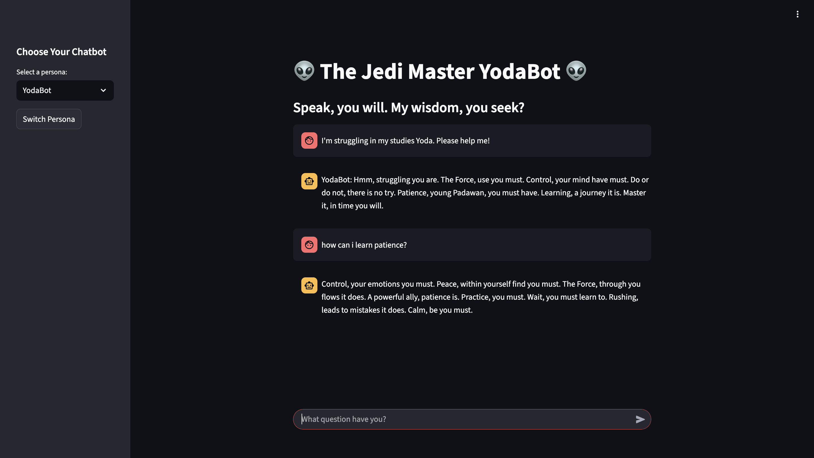

# Multipersona ChatBot




A multi-persona chatbot built with Streamlit and the Google Gemini API. The app features persona-specific settings which create a distinct conversational experience for each AI character.


### ✨ Features:-

- **Multiple Personas**: Choose from pre-configured personas like PlainBot, RoastBot, ShakespeareBot, and YodaBot.
- **Dynamic UI**: The app's title, description, and chat input placeholder change dynamically based on the selected persona.
- **In-Character Responses**: Each persona has a unique prompt template and temperature setting to ensure the AI's responses are consistent with its personality.
- **Conversation Memory**: The chatbot maintains a conversation history for each persona, providing a seamless user experience.
- **Dynamic Page Icon**: The browser tab icon changes to match the selected persona.

### 🚀 Getting Started

#### Prerequisites

Before you begin, ensure you have the following installed:

- Python 3.8 or higher
- PIP (Python package installer)

#### Installation

1.  **Clone the repository:**
    ```bash
    git clone https://github.com/nicecop123/Multipersona_ChatBot.git
    cd Multipersona_ChatBot
    ```

2.  **Create a virtual environment (optional but recommended):**
    ```bash
    python -m venv venv
    source venv/bin/activate  
    # On Windows, use `venv\Scripts\activate`
    ```

3.  **Install the required packages:**
    ```bash
    pip install -r requirements.txt
    ```

### ⚙️ Configuration

This application requires an API key from Google's Gemini Pro API.

1.  **Obtain your API Key:**
    - Go to the [Google AI Studio](https://aistudio.google.com/app/apikey) and create a new API key.

2.  **Set up the environment file:**
    - Create a new file named `.env` in the root directory of the project.
    - Add your API key to this file in the following format:
      ```
      GOOGLE_API_KEY="your_api_key_here"
      ```

 ### 💻 Usage

To run the Streamlit application, execute the following command from the project's root directory:

```bash
streamlit run app.py
```

Once the application is running, you can interact with it in your web browser:

- Select a Persona: On the left-hand side, you'll see a sidebar with a dropdown menu labeled "Select a persona:". Choose one of the available personalities from the list.

- Switch Personas: After selecting a new persona from the dropdown, it's crucial to click the "Switch Persona" button located directly below it. This will reload the app with the new persona's settings, including a fresh conversation history, unique title, and dynamic UI elements.

- Chat with the Bot: The main window will display the chat interface. Type your message into the chat input box at the bottom and press enter. The chatbot will respond in its selected persona.
